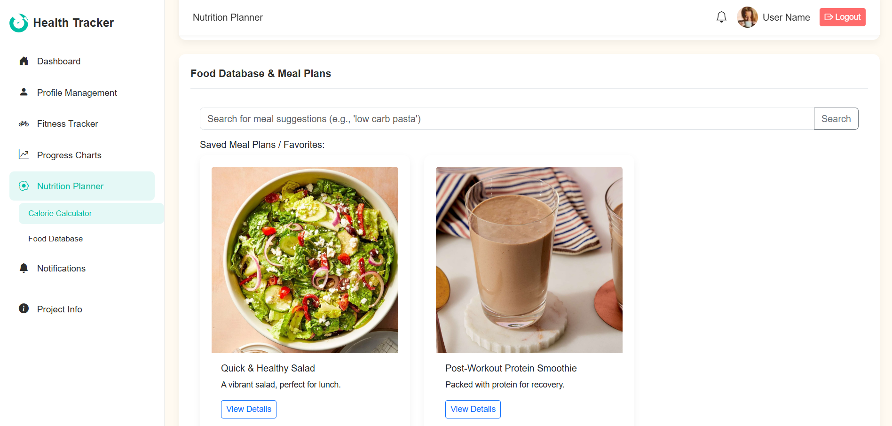
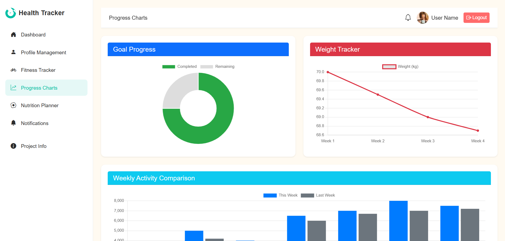

# Health & Fitness Tracker

This is a comprehensive web application designed to help users track their health and fitness goals. It features an intuitive interface for monitoring nutrition, workouts, steps, progress, and more - all in one place with personalized insights.


## Table of Contents
- [Health & Fitness Tracker](#health--fitness-tracker)
  - [Table of Contents](#table-of-contents)
  - [Key Features](#key-features)
  - [Screenshots](#screenshots)
  - [Technologies Used](#technologies-used)
  - [Prerequisites](#prerequisites)
  - [Getting Started](#getting-started)
  - [Color Scheme](#color-scheme)
    - [Primary Color: Teal (Vitality & Freshness)](#primary-color-teal-vitality--freshness)
    - [Accent Color: Coral (Energy & Action)](#accent-color-coral-energy--action)
    - [Secondary/Support Color: Emerald Green (Health & Nature)](#secondarysupport-color-emerald-green-health--nature)
    - [Background: Light Gray/Off-White (Clean, Minimal)](#background-light-grayoff-white-clean-minimal)
    - [Text: Dark Charcoal Gray (Readable & Soft Contrast)](#text-dark-charcoal-gray-readable--soft-contrast)
  - [CSS Implementation](#css-implementation)
  - [Usage](#usage)
  - [API Endpoints](#api-endpoints)
  - [Documentation](#documentation)
  - [Contributors](#contributors)


## Key Features

- **User Authentication**: Secure user registration and login system.
- **Personalized Dashboard**: At-a-glance overview of recent activities, goals, and stats.
- **Workout & Activity Logging**:
    - Log different types of activities (cardio, strength, etc.).
    - Create and manage workout routines with specific exercises.
    - Full CRUD (Create, Read, Update, Delete) functionality for all entries.
    - Track workout streaks to stay motivated.
- **Steps Tracking & Route Finder**:
    - Manually log steps, distance, and duration.
    - **Automatic Step Calculation**: Estimates steps based on user's height, distance, and duration.
    - **Nearby Route Finder**: Integrates with Mapbox to find walking, running, or cycling routes near the user's location.
    - Interactive map to view and select different route options.
- **Nutrition Tracking**:
    - Log meals and track calorie intake.
    - Upload pictures of meals.
    - View daily nutrition summaries and trends.
- **Weight & Progress Tracking**:
    - Log weight entries over time.
    - Interactive charts to visualize progress.
- **Comprehensive Notification System**:
    - Web Push Notifications for real-time alerts.
    - Scheduled Notifications/Reminders that can be customized.
    - Email notifications for important reminders.
- **Profile Management**:
    - View and update user profile information (name, age, height, weight).
    - Upload a profile picture.
    - Securely change passwords.
    - Configure notification preferences.
- **Progress Visualization**:
    - Interactive charts and graphs to monitor progress over time (e.g., weight, calories).
- **Responsive Design**:
    - Collapsible sidebar for a seamless experience on mobile devices.
    - Fully responsive layout that adapts to all screen sizes.

## Screenshots

Here are some screenshots of the application:





## Technologies Used

- **Frontend**: 
  - HTML, CSS, JavaScript
  - Bootstrap 5 (responsive design)
  - Chart.js (data visualization)
- **Backend**: 
  - Node.js, Express.js
  - RESTful API architecture
- **Database**: 
  - MongoDB (with native driver)
  - connect-mongo (session storage)
- **Authentication**: 
  - bcrypt (password hashing)
  - express-session (session management)
- **Notifications**: 
  - web-push (browser notifications)
  - nodemailer (email notifications)
  - node-cron (scheduled tasks)
- **File Uploads**: 
  - multer
- **External APIs**:
  - Mapbox (route finding)
- **Development**: 
  - nodemon (auto-reloading)
  - dotenv (environment variables)

## Prerequisites

- [Node.js](https://nodejs.org/) (v14+)
- [npm](https://www.npmjs.com/)
- [MongoDB Atlas](https://www.mongodb.com/cloud/atlas) account for the database
- [Mapbox Account](https://www.mapbox.com/) for the route finder functionality
- Gmail account (for sending email notifications)

## Getting Started

1.  **Clone the repository:**
    ```sh
    git clone https://github.com/imanhaikal/g6-webprog.git
    cd g6-webprog
    ```

2.  **Install dependencies:**
    ```sh
    npm install
    ```

3.  **Set up your environment:**
    - Create a `.env` file in the root of the project.
    - Add your MongoDB Atlas connection string and other required variables:
      ```
      # MongoDB Atlas connection string
      MONGO_URI="mongodb+srv://<username>:<password>@your-cluster-url"

      # Secret key for signing session cookies
      SESSION_SECRET="your_strong_session_secret"

      # VAPID keys for Web Push Notifications (generate with `npm run vapi`)
      VAPID_PUBLIC_KEY="your_public_vapid_key"
      VAPID_PRIVATE_KEY="your_private_vapid_key"
      
      # Gmail credentials for sending email notifications
      GMAIL_USER="your_gmail_address@gmail.com"
      GMAIL_APP_PASS="your_gmail_app_password"

      # Mapbox access token for route finder
      MAPBOX_TOKEN="your_mapbox_access_token"
      ```
    - To generate VAPID keys for web-push, run:
      ```sh
      npm run vapi
      ```

4.  **Run the application:**
    - For production:
        ```sh
        npm start
        ```
    - For development (with auto-restarting server):
        ```sh
        npm run dev
        ```
    The server will start on `http://localhost:3000`.

## Color Scheme

This project uses a carefully selected color palette designed to convey health, vitality, and wellness:

### Primary Color: Teal (Vitality & Freshness)
- HEX: `#00BFA6`
- RGB: `rgb(0, 191, 166)`

### Accent Color: Coral (Energy & Action)
- HEX: `#FF6B6B`
- RGB: `rgb(255, 107, 107)`

### Secondary/Support Color: Emerald Green (Health & Nature)
- HEX: `#2ECC71`
- RGB: `rgb(46, 204, 113)`

### Background: Light Gray/Off-White (Clean, Minimal)
- HEX: `#FFFAF1`

### Text: Dark Charcoal Gray (Readable & Soft Contrast)
- HEX: `#2D2D2D`
- RGB: `rgb(45, 45, 45)`

## CSS Implementation

The color scheme is implemented using CSS variables for consistency across the application. These variables are defined in `css/style.css` and available throughout the application.

```css
:root {
    /* Color Scheme Variables */
    --primary-color: #00BFA6;       /* Teal */
    --accent-color: #FF6B6B;        /* Coral */
    --secondary-color: #2ECC71;     /* Emerald Green */
    --background-color: #FFFAF1;    /* Light Gray/Off-White */
    --text-color: #2D2D2D;          /* Dark Charcoal Gray */
    
    /* Additional derived variables */
    --primary-hover: #00a890;
    --accent-hover: #ff5252;
    --secondary-hover: #27ae60;
    
    /* Lighter shades for backgrounds */
    --primary-light: rgba(0, 191, 166, 0.1);
    --accent-light: rgba(255, 107, 107, 0.1);
    --secondary-light: rgba(46, 204, 113, 0.1);
}
```

## Usage

To use these colors in your CSS:

```css
.my-element {
    background-color: var(--primary-color);
    color: white;
}

.button:hover {
    background-color: var(--primary-hover);
}
```

## API Endpoints

The application provides a comprehensive RESTful API. Here are some key endpoints:

- **Authentication**: `/register`, `/login`, `/logout`
- **User Profile**: `/api/profile`
- **Activities**: `/log-activity`, `/get-all-activities`
- **Workouts**: `/api/workouts`, `/api/workout-templates` 
- **Steps**: `/api/steps`
- **Nutrition**: `/api/nutrition/meals`
- **Notifications**: `/subscribe`, `/api/scheduled-notifications`

For a complete list of endpoints with descriptions, please see the [Project Documentation](documentation.md#api-endpoints).

## Documentation

For detailed technical information, including API endpoints and architecture, please see the [Project Documentation](documentation.md).

## Contributors

- Iman Haikal
- Amir Mustaqim
- Rubab
- Aqmar
- Aliff
